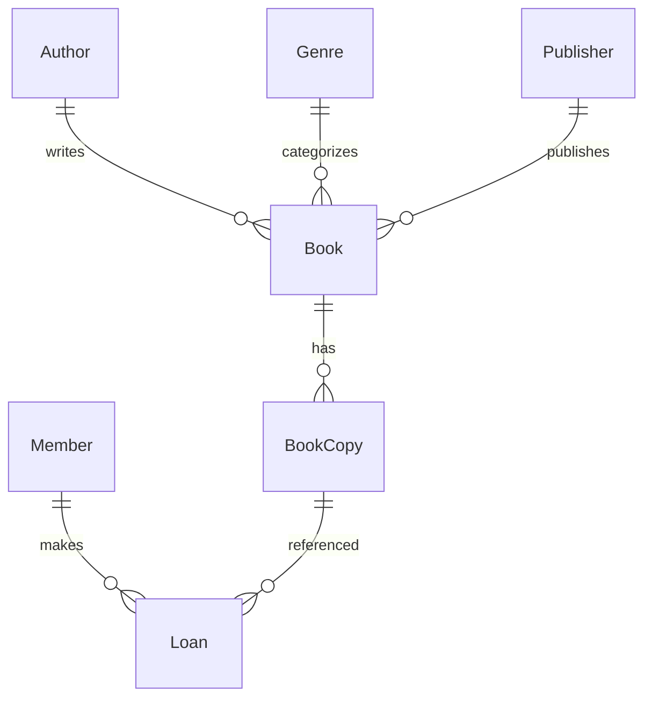
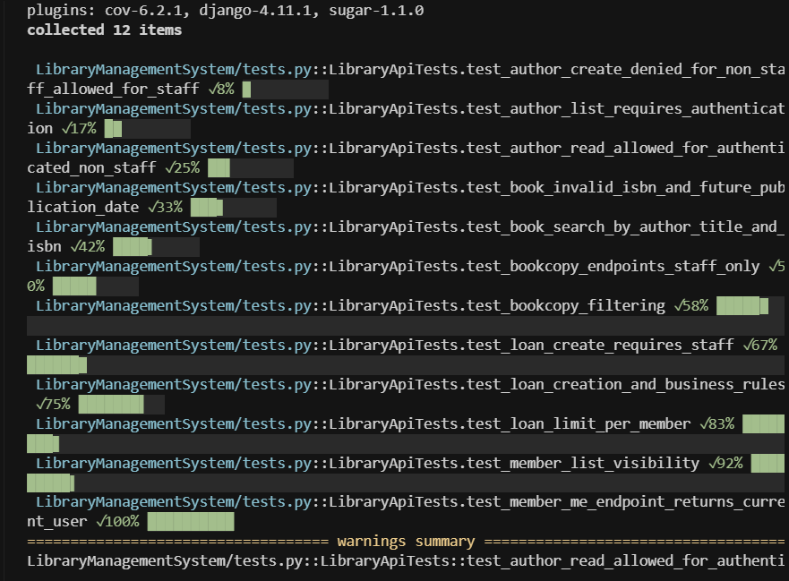
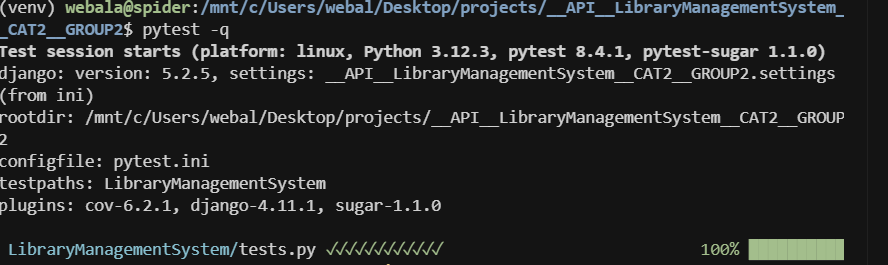

# Library Management System API

A Django REST Framework API for managing a library: authors, genres, publishers, books, physical copies, members, and loans.

Base API path: `/api/library/`

## Group Members

- Member 1 — ADM No.: 171748
- Member 2 — ADM No.: 105241
- Member 3 — ADM No.: 170459
- Member 4 — ADM No.: 169258
- Member 4 — ADM No.: 170417
- Member 4 — ADM No.: 172235


## Quick Start

1. Clone and set up environment

```bash
python -m venv venv
venv\Scripts\activate  # on Windows PowerShell: .\venv\Scripts\Activate.ps1
pip install -r requirements.txt
```

2. Migrate and create an admin user

```bash
python manage.py migrate
python manage.py createsuperuser
```

3. Run the server

```bash
python manage.py runserver
```

4. Log in to the Django admin at `/admin/` to create data. You can use the browsable API with SessionAuth or create tokens via admin under "Tokens" (app: `authtoken`).

## Project Structure (key files)

- `__API__LibraryManagementSystem__CAT2__GROUP2/settings.py`: project settings, DRF config, `AUTH_USER_MODEL`.
- `LibraryManagementSystem/models.py`: domain models.
- `LibraryManagementSystem/serializers.py`: DRF serializers and validation rules.
- `LibraryManagementSystem/views.py`: viewsets and permissions.
- `LibraryManagementSystem/urls.py`: routers for app endpoints.
- `__API__LibraryManagementSystem__CAT2__GROUP2/urls.py`: includes app routes at `/api/library/`.

## Step-by-step Implementation Overview

1. Models and relationships (`LibraryManagementSystem/models.py`)



- `Author(name, birth_date, nationality)`
  - Unique `name`
- `Genre(name, description)`
  - Unique `name`
- `Publisher(name, address, website)`
  - Unique `name`
- `Book(title, authors[M2M], genre[FK], publisher[FK], publication_date, isbn[unique], pages, language)`
- `BookCopy(book[FK], copy_id[unique], acquisition_date, status{available|on_loan|maintenance|lost}, condition_rating 1..5)`
- `Member` extends `AbstractUser` with `membership_type{standard|premium|student}`, `join_date`, `phone`
  - Uses custom `groups` and `user_permissions` related_names to avoid clashes
- `Loan(book_copy[FK PROTECT], member[FK PROTECT], loan_date, due_date, return_date, fine_amount)`

2. Serializers and validation rules (`LibraryManagementSystem/serializers.py`)

- `AuthorSerializer`
  - `name` min length 2
  - `birth_date` cannot be in the future
- `GenreSerializer`
  - `name` must be alphanumeric/spaces
- `PublisherSerializer`
  - `website` must start with http/https
- `BookSerializer`
  - `isbn` must be 10 or 13 digits; unique on create/update (custom checks)
  - `publication_date` cannot be in the future
  - `pages` >= 1
- `BookCopySerializer`
  - `acquisition_date` not in the future
  - `condition_rating` between 1 and 5
  - `copy_id` unique per `book` (custom cross-field validation)
- `MemberSerializer`
  - Requires `email` (unique) and `password` (>= 8 chars)
  - Hashes password on create/update
- `LoanSerializer`
  - `loan_date`/`return_date` not in the future
  - `due_date` must be after `loan_date`
  - Ensures `book_copy` is available when creating
  - Limits active loans per member to max 5

3. Viewsets and permissions (`LibraryManagementSystem/views.py`)

- Shared permissions

  - `IsStaffOrReadOnly`: staff can write; others read-only
  - `IsStaff`: only staff allowed
  - `IsSelfOrStaff`: users can access their own record; staff can access all

- Viewsets
  - `AuthorViewSet` (Auth required, `IsStaffOrReadOnly`)
    - Search `?search=<name>`
  - `GenreViewSet` (Auth required, `IsStaffOrReadOnly`)
  - `PublisherViewSet` (Auth required, `IsStaffOrReadOnly`)
  - `BookViewSet` (Auth required, `IsStaffOrReadOnly`)
    - Search title/author/isbn via `?search=<term>`
  - `BookCopyViewSet` (Auth + `IsStaff` for all ops)
    - Filter: `?book=<id>&status=<status>&min_condition=<n>`
  - `MemberViewSet` (Auth + `IsSelfOrStaff`)
    - Non-staff: only see own record
    - Extra action: `GET /members/me/` returns current user
  - `LoanViewSet` (Auth)
    - Non-staff: only their own loans on list/retrieve
    - Create/Update/Delete restricted to staff

4. URL patterns (`LibraryManagementSystem/urls.py` and project `urls.py`)

Base path: `/api/library/`

- `/authors/`
- `/genres/`
- `/publishers/`
- `/books/`
- `/copies/`
- `/members/`
  - `/members/me/`
- `/loans/`

Each route supports standard DRF ModelViewSet actions:

- List: `GET /<route>/`
- Create: `POST /<route>/`
- Retrieve: `GET /<route>/{id}/`
- Update: `PUT/PATCH /<route>/{id}/`
- Delete: `DELETE /<route>/{id}/`

Authentication: DRF Token, Session, or Basic (see `REST_FRAMEWORK` in settings). Use SessionAuth via admin login for the browsable API, or create tokens in admin.

## Example Requests (cURL)

Authenticate with a token (if using TokenAuth):

```bash
# After creating a Token in admin for your user
curl -H "Authorization: Token <your_token>" http://127.0.0.1:8000/api/library/authors/
```

Create an author (staff user):

```bash
curl -X POST http://127.0.0.1:8000/api/library/authors/ \
  -H "Content-Type: application/json" \
  -H "Authorization: Token <token>" \
  -d '{"name": "Isaac Asimov", "birth_date": "1920-01-02", "nationality": "American"}'
```

Search books:

```bash
curl -H "Authorization: Token <token>" \
  "http://127.0.0.1:8000/api/library/books/?search=asimov"
```

Get current member profile:

```bash
curl -H "Authorization: Token <token>" \
  http://127.0.0.1:8000/api/library/members/me/
```

## Running Tests

- Built-in Django test runner:

```bash
python manage.py test -v 2
```

- Recommended: pytest (cleaner, colored output). Install once:

```bash
pip install pytest pytest-django pytest-cov pytest-sugar
```

Then run:

```bash
# quiet concise output
pytest -q

# verbose with short tracebacks
pytest -v

# stop on first failure
pytest -v --maxfail=1

# coverage summary for the app
pytest --cov=LibraryManagementSystem --cov-report=term-missing
```

### Testing Evidence







